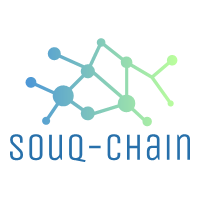
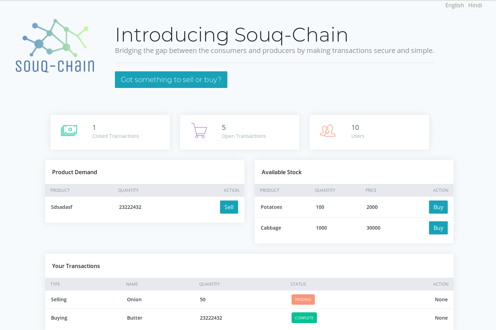
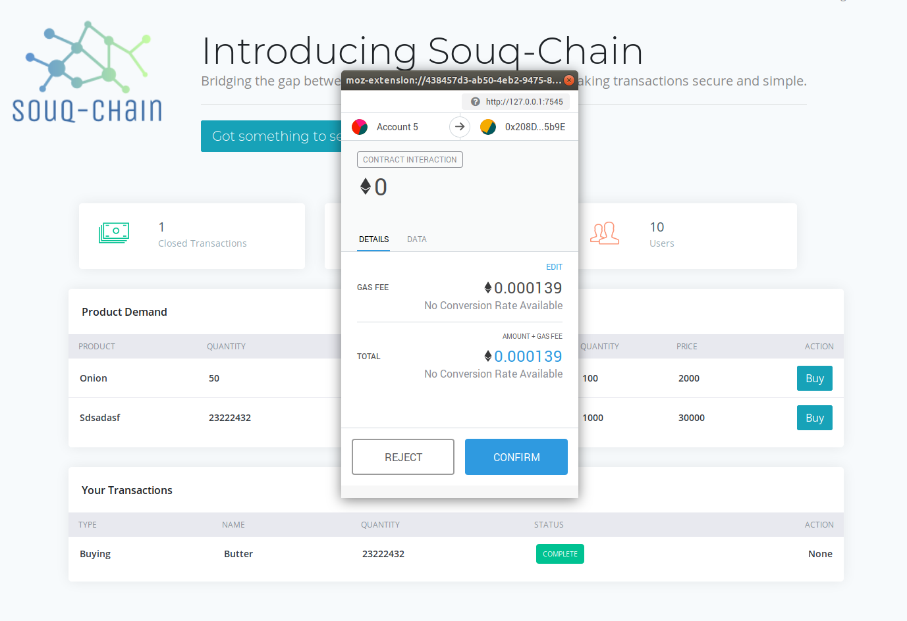

# **PROJECT Souq-Chain**

**This project is developed as a part of Hack In the North 4.0.**

## **PROBLEM STATEMENT:**

In a country like India, where a huge majority of the people are engaged in agriculture as their primary income, the people doing the hard work, the farmers, are being cunningly exploited by a multilayered system of intermediaries and cartels.

The middlemen exploits the loopholes in the system to make a fortune at the cost of sweat and blood of a simple farmer. They buy the produce at a cheap rate and sell the goods at a considerably higher price. The farmers never get a fair share. Even worse, many a times they are denied the prices agreed upon in the original deal and are forced to sell their produce at a far cheaper rate than promised.

Many a times, the farmers even throw away their produce due to illusion of "no-demand" created by this opaque intermediate layers. Consumers buy items at insane high rates and farmers sell off their good at ridiculously low prices. The whole game of illusion of over-availability or non-availability is centralized in the hands of middlemen, they direct it as they want.

## **OUR SOLUTION:**

Our idea is to design a crackdown on this corrupted system with a robust decentralized application. Ensure farmer awareness and exposure, and, guarantee returns for their crops.

We are making a unified block-chain based platform for the farmers and the buyers to eliminate the intermediaries. This will benefit the small scale rural farmers and the end buyers. Everyone connected to the blockchain will have the data. The application will have a simple UI to enable uses with minimal training.

One can either create a supply of goods or demand of goods, reflecting the name and quantity of the item. A user can accept a demand based on his available stock.

Once a deal is made between a supplier(farmer) and a consumer, it cannot be altered or tempered without mutual consent.

A supplier can monitor the market price as he has access to the transactions happening around.

In case a deal has to be cancelled after processing it, the farmer can claim some amount of compensation. The buyer cannot deny placing an order or he cannot tamper the agreed price as the system is decentralized and a transaction in one block is reflected throughout the subsequent blocks. To retroactively alter a transaction/deal data, once must have majority consent(51% at least), which requires so huge a computing resource that it is practically impossible. Thus the system will be effectively unhackable and reliably uphold the interest of both farmers and buyers.

## Screenshots:

&nbsp&nbsp&nbsp&nbsp

## Contributors :

1. [Nityananda Gohain](https://github.com/nityanandagohain)
2. [Adirtha Borgohain](https://github.com/AdirthaBorgohain)
3. [Sourish Sarmah](https://github.com/sourishsarmah)
4. [Ramyanee Kashyap](https://github.com/Ramyanee)
